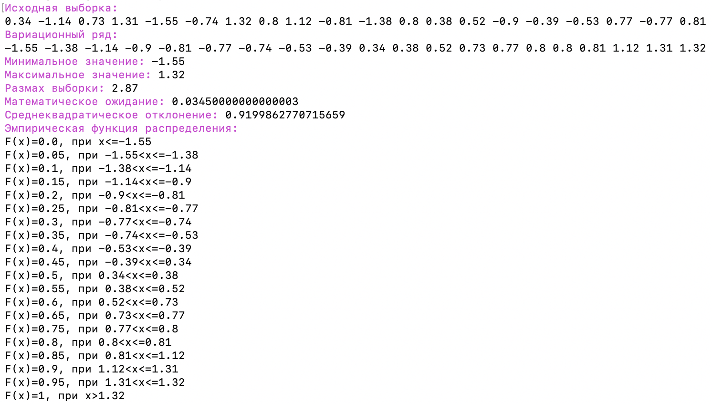
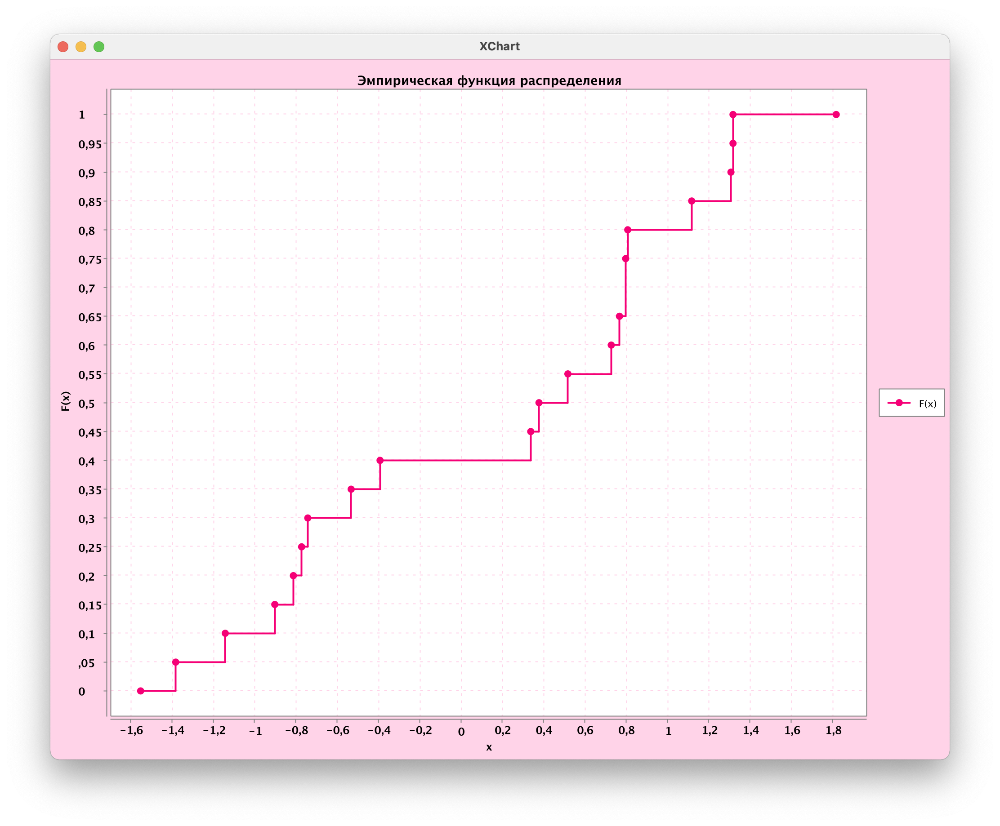
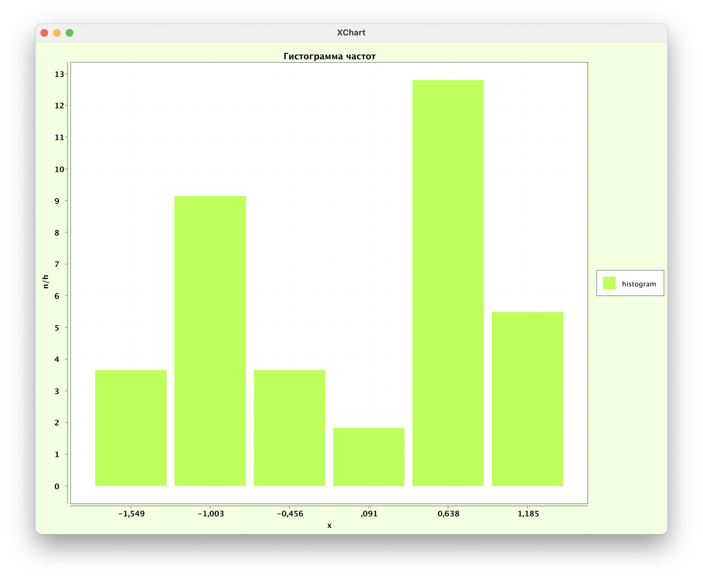
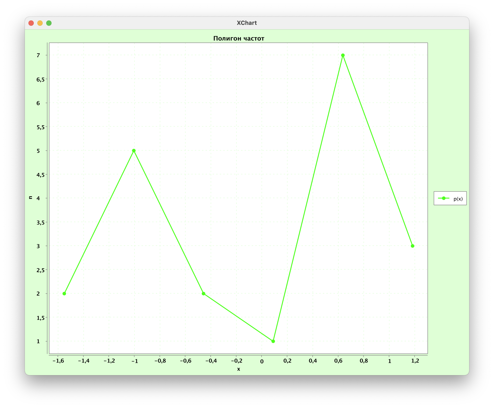

# selections-and-their-characteristics
### Задание
Каждый студент получает выборку из 20 чисел. Необходимо определить следующие статистические характеристики: вариационный ряд, экстремальные значения и размах, оценки математического ожидания и среднеквадратического отклонения, эмпирическую функцию распределения и её график, гистограмму и полигон приведенных частот группированной выборки. Для расчета характеристик и построения графиков нужно написать программу на одном из языков программирования. Листинг программы и результаты работы должны быть представлены в отчете по практической работе.
### Выборка
`{0.34, -1.14, 0.73, 1.31, -1.55, -0.74, 1.32, 0.8, 1.12, -0.81, -1.38, 0.8, 0.38, 0.52, -0.9, -0.39, -0.53, 0.77, -0.77, 0.81}`
### Результат

